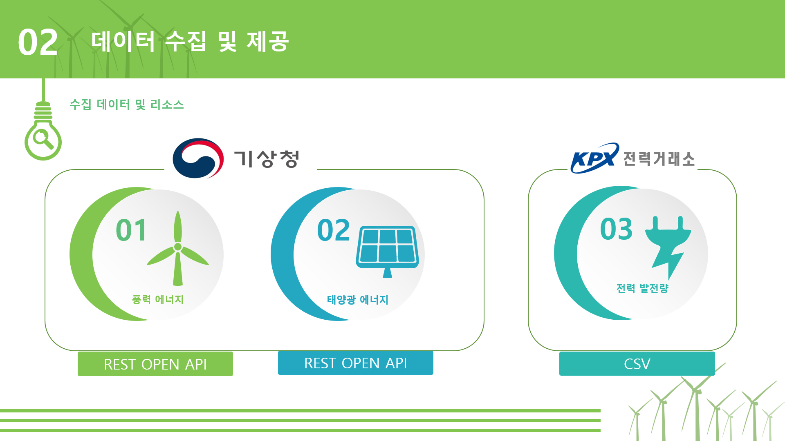
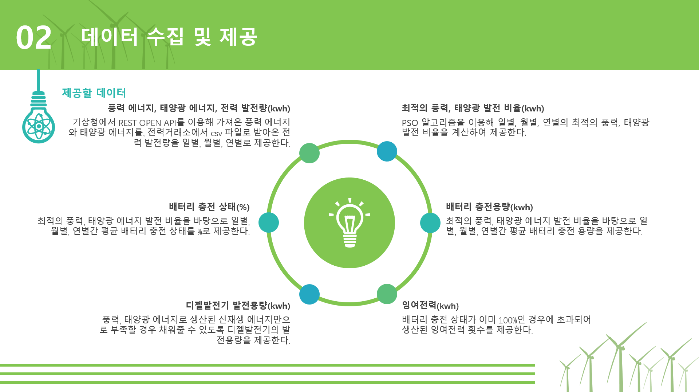
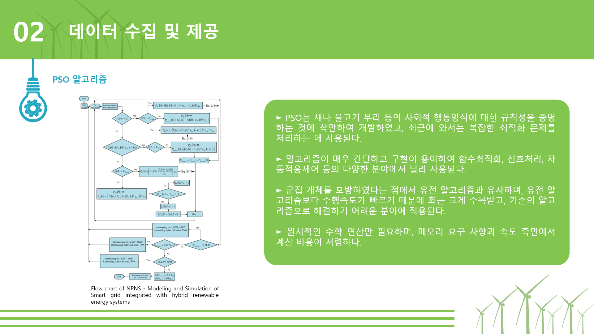
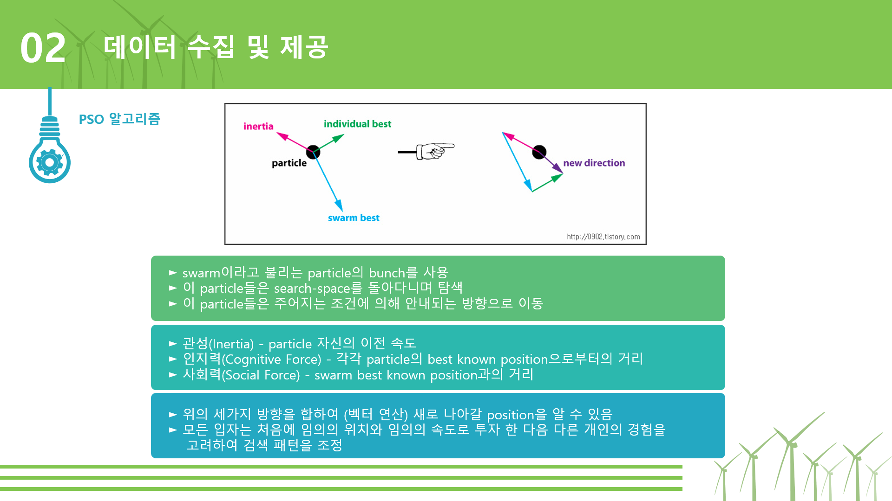
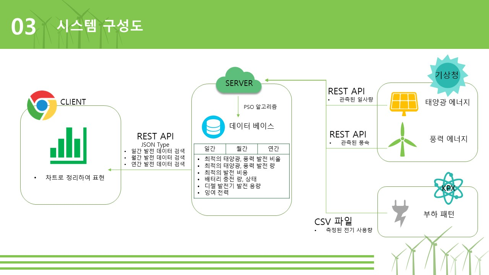
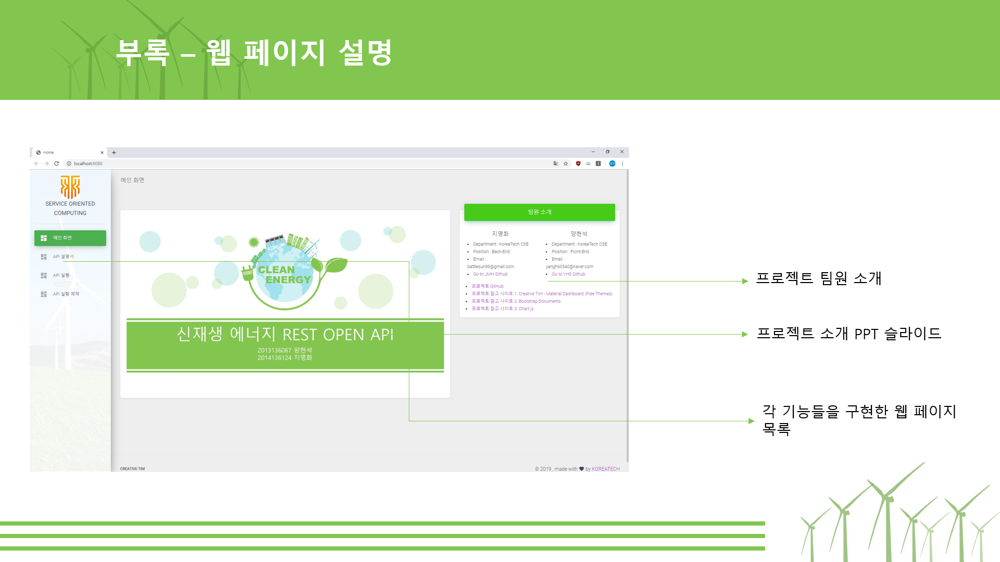
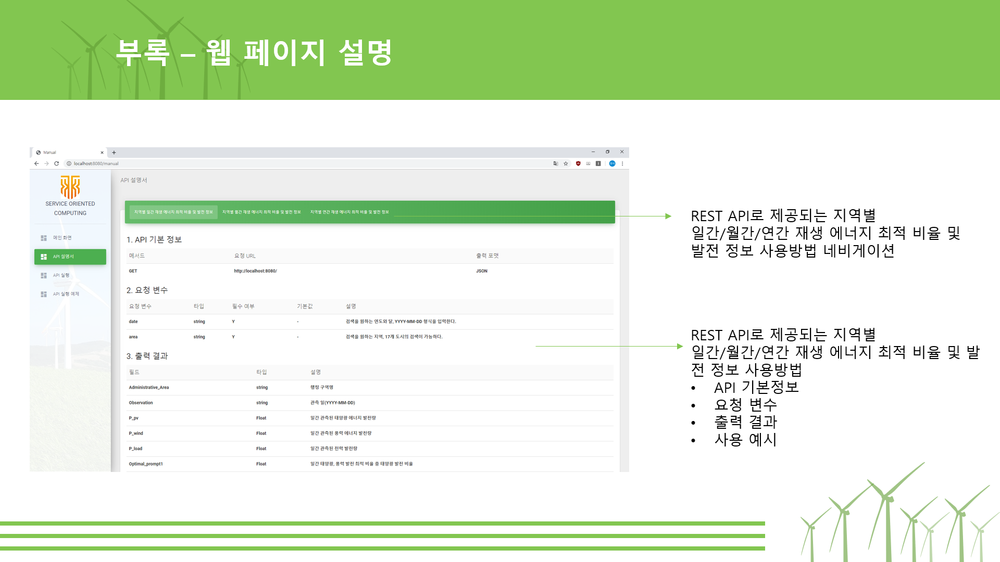
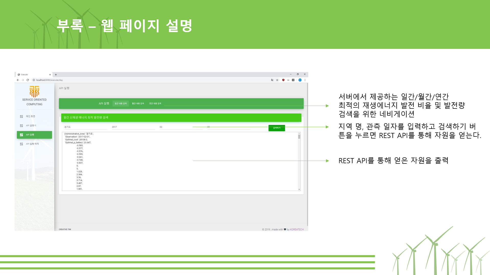
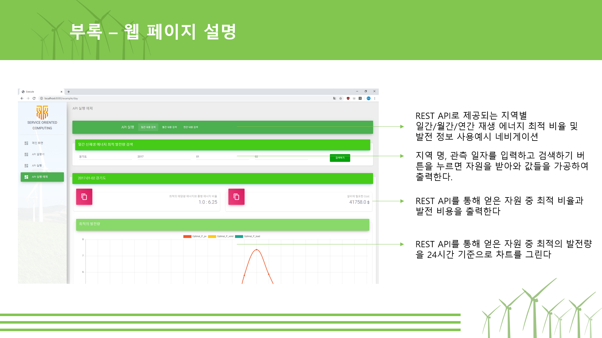
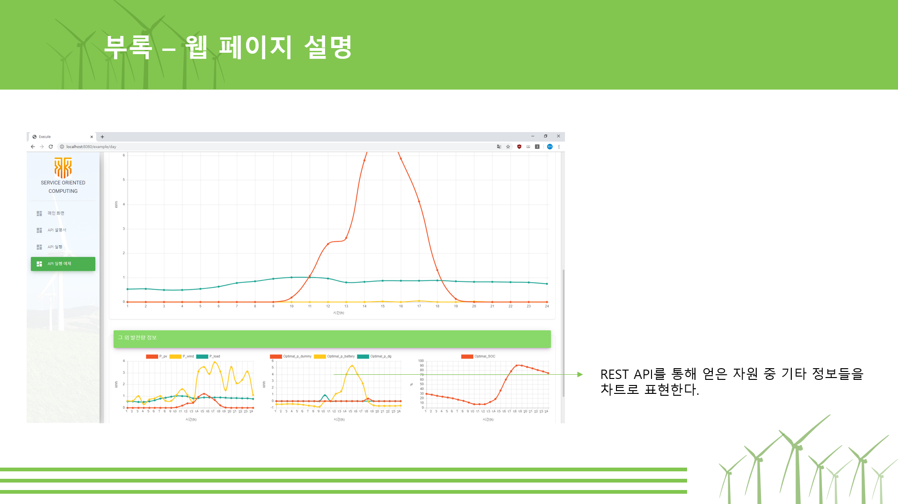

SOC Project
====

## Service Oriented Computing
서비스 지향 컴퓨팅은 분산 컴퓨팅에 대한 새로운 학제 간 패러다임으로 소프트웨어 응용 프로그램의 설계, 제공 및 소비 방식을 변화시키고 있습니다.
서비스 지향 컴퓨팅의 핵심에는 표준 프로토콜을 사용하여 설명, 게시, 발견, 오케스트레이션 및 프로그래밍 할 수 있는 자율적이고 플랫폼에 독립적 인 계산 요소를 제공하는 서비스가 조직 경계 내부 및 조직 경계에 분산 된 협업 애플리케이션 네트워크를 구축합니다.

## Hybrid (Wind / Solar) Energy REST OPEN API Service
1. 주제

    하이브리드 (풍력 / 태양 광) 에너지 REST OPEN API 서비스

2. 필요성

    + 우리나라에서는 2011년 정전사태 이후 시간별 전력수요 예측의 중요성이 더욱 커지고 있다. – 2013 수시 연구 보고서
    
    + 화석연료 에너지의 의존도가 높아지는 추세로 재사용 에너지의 활용은 큰 트렌드로 대두되고 있다. – 2017. Modeling and Simulation of Smart Grid Integrated with Hybrid Renewable Energy System
    
        + __신재생 에너지의 최적화된 발전량 계산 필요성 증가__

3. 대상

    + 신재생 에너지 설비 업체로 이들은 우리가 제공하는 서비스를 통해 화석연료로 발전되고 있는 지역에 신재생 에너지 발전 설비로 교체하는데 용이하다.
    
    + 발전 설비를 만들 때 지역마다 연간 평균적으로 생산되는 최적의 발전량을 구할 수 있다면 설비 업체에서 최고의 안정성을 통한 전력 생산량 발전과 최저의 설비 비용으로 설치가 가능하다.
    
        + __투자의 경제적 이익 극대화를 목표__
        
데이터 수집 및 제공(Feat. PSO Algorithm)
------

구성도
------

웹 페이지 설명
------

수행 URL
------
[Service Web Page](http://54.237.26.53:5000/)
